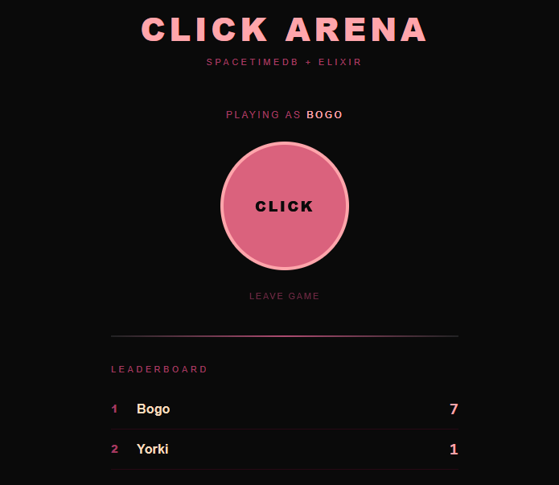

# Click Arena



A real-time multiplayer clicking game built with **Phoenix LiveView** and **SpacetimeDB**.

Players join with a name, compete for clicks on a shared leaderboard, and hunt for bonus buttons that spawn around the main click target.

## Stack

- **Frontend**: Phoenix LiveView (Elixir) — no JavaScript needed for real-time updates
- **Backend DB**: SpacetimeDB (Rust WASM module) — server-authoritative game state
- **Bridge**: [Spacetimedbex](https://github.com/phiat/spacetimedbex) — Elixir client for SpacetimeDB over WebSocket
- **Styling**: Hand-written CSS, neo-Bauhaus dark theme

## Running locally

### Prerequisites

- Elixir 1.17+
- SpacetimeDB CLI (`spacetime`) with a local instance running on port 3000
- Rust toolchain with `wasm32-unknown-unknown` target

### SpacetimeDB module

```bash
cd click_arena_module
cargo build --target wasm32-unknown-unknown --release
spacetime publish clickarena3
```

### Phoenix server

```bash
cd outsider_gong
mix setup
mix phx.server
```

Visit [localhost:4000](http://localhost:4000).

## How it works

1. Players join by entering a name — this calls the `join_game` reducer in SpacetimeDB
2. Clicking the big button calls the `click` reducer, incrementing score by 1
3. Every 50 clicks (50% chance), a bonus button spawns around the main button worth +10 points
4. Timed bonus buttons also spawn randomly every 30-90 seconds
5. The leaderboard updates in real-time via SpacetimeDB subscriptions piped through Phoenix PubSub
6. Re-joining with the same name reclaims your leaderboard slot (no duplicates)
